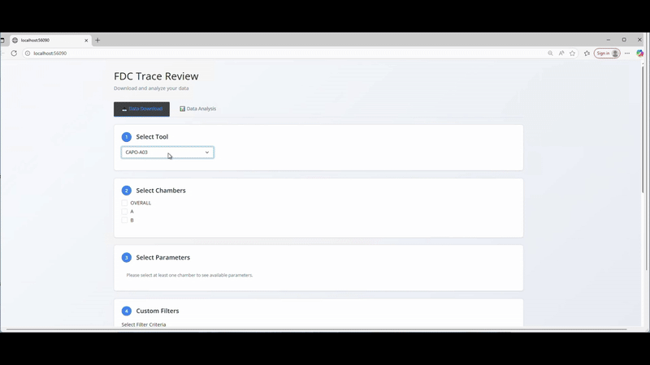
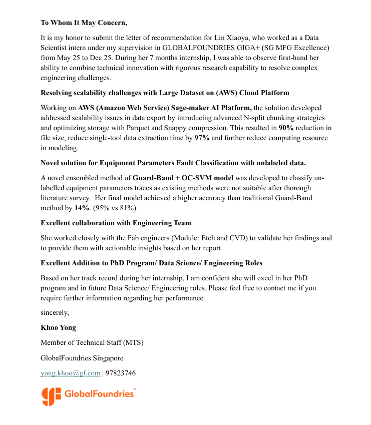

# 💼Research & Professional Work Experience

## 1. GlobalFoundries | Data Scientist Intern
*May 2025 – Dec 2025 | Singapore*

> *During my 7-month internship, I combined technical innovation with rigorous research to resolve complex engineering challenges.*

<table width="100%">
  <tr>
    <td width="55%">
      <h3>Trace Data ETL Pipeline</h3>
      

        <strong>The Problem:</strong> Processing multi-month sensor traces caused memory crashes and took hours. 
        <strong>The Solution:</strong> Built a scalable ETL pipeline using <code>AWS SageMaker</code>, <code>PySpark</code>, and <code>Snappy</code> compression.
      

      <ul>
        <li>📉 <strong>90%</strong> Reduction in storage file size.</li>
        <li>⚡ <strong>97%</strong> Faster data extraction time.</li>
        <li>🛠 <strong>Tech:</strong> <code>PySpark</code>, <code>AWS S3/Boto3</code>, <code>Parquet + Snappy</code>, <code>ETL Optimization</code>.</li>
      </ul>
       
      <blockquote>
        "The solution developed addressed scalability issues... resulted in 90% reduction in file size."
      </blockquote>
      
    </td>
    <td width="45%">
      
    </td>
  </tr>
</table>

<table width="100%">
  <tr>
    <td width="55%">
      <h3>Trace-to-Image Fault Detection (GAF-CNN)</h3>
      

        <strong>The Problem:</strong> Existing methods were not suitable for classifying unlabeled equipment parameter traces. 
        <strong>The Solution:</strong> Engineered a novel ensembled method of <strong>Guard-Band + OC-SVM</strong> using Gramian Angular Fields (GAF).
      

      <ul>
        <li>🎯 <strong>95%</strong> Accuracy (Outperforming Guard-Band by 14%).</li>
        <li>🛡 <strong>Valid</strong> for unlabeled anomalies (Zero False Alarms).</li>
        <li>🛠 <strong>Tech:</strong> <code>Python (PyTorch)</code>, <code>Gramian Angular Fields (GAF)</code>, <code>CNN</code>, <code>One-Class SVM</code>.</li>
      </ul>
       
      <blockquote>
        "Her final model achieved a higher accuracy than traditional Guard-Band method by 14%."
      </blockquote>
      
    </td>
    <td width="45%">
      
    </td>
  </tr>
</table>

<table width="100%">
  <tr>
    <td width="70%" valign="top">
      <h3>🏆 Internship Endorsement - Recommendation Letter</h3>
      
<strong>Supervisor:</strong> Mr. Khoo Yong (Member of Technical Staff, GlobalFoundries)

      <blockquote>
        "I was able to observe first-hand her ability to combine technical innovation with rigorous research capability... I am confident she will excel in her PhD program and in future Data Science/ Engineering roles."
      </blockquote>
    </td>
    <td width="30%" valign="top" align="center">
      
       
      Click to read full letter
    </td>
  </tr>
</table>

 

## 2. OCBC Bank | Data Analyst Intern (Project Data Analysis)
*Jan 2026 – Present | Singapore*

* Led a 4-person multidisciplinary team to build an end-to-end automation system using **Power Automate and Python**, targeting the elimination of manual data extraction for the Talent Acquisition team.
* Developed a **Power BI** dashboard to track "Active Requisitions" and "YTD Performance," enabling real-time monitoring of recruiter-specific closure rates and vacancy trends.
* Established a standardized information architecture to categorize diverse hiring data, ensuring high data integrity for executive decision-making.

 

## 3. Shenzhen InnoX Academy | Market Data Analyst Intern
*Dec 2025 – Jan 2026 | Hybrid*

<table width="100%">
  <tr>
    <td width="60%">
      <h3>Project: "Interactive Clothes" GTM Strategy</h3>
      

        <strong>The Problem:</strong> The product lacked market fit, oscillating between saturated "fitness" and "gaming" markets with high CAC. 
        <strong>The Solution:</strong> Pivoted to "Somatic Wellness" via Python sentiment analysis and engineered the digital launch infrastructure.
      

      <ul>
        <li>🚀 <strong>500+ Leads</strong> captured in 48h via custom Landing Page.</li>
        <li>📊 <strong>Analytics:</strong> Mined competitor reviews to identify "Subscription Fatigue" as a key pain point.</li>
        <li>🛠 <strong>Tech:</strong> <code>Python (NLP)</code>, <code>Tableau</code>, <code>HTML5/Tailwind</code>, <code>GTM Strategy</code>.</li>
      </ul>
       
      
    </td>
    <td width="40%" align="center">
      
        
      
        
      
    </td>
  </tr>
</table>

 

## 4. A*STAR | Healthcare Data Research Intern
*Jan 2025 – Apr 2025 | Singapore*

**Project: Anonymization Workflows for Confidential Medical Datasets**
* Co-led a team of 5 in a collaboration with **SG National Healthcare Group (NHG)** to anonymize facial healthcare datasets for AI validation.
* Addressed the trade-off between data utility and patient privacy, a core challenge in observational healthcare data.
* Performed feature preservation analysis through rPPG-tool to optimize preprocessing for downstream AI performance.

 

## 5. Classbro (Shanghai DAOBI EdTech) | Data Science Instructor
*Jun 2024 – Dec 2024 | Hybrid*

* Developed and delivered bilingual lectures on core ML algorithms and SQL.
* Designed course content that contributed **SGD 10,000+ revenue growth**.
