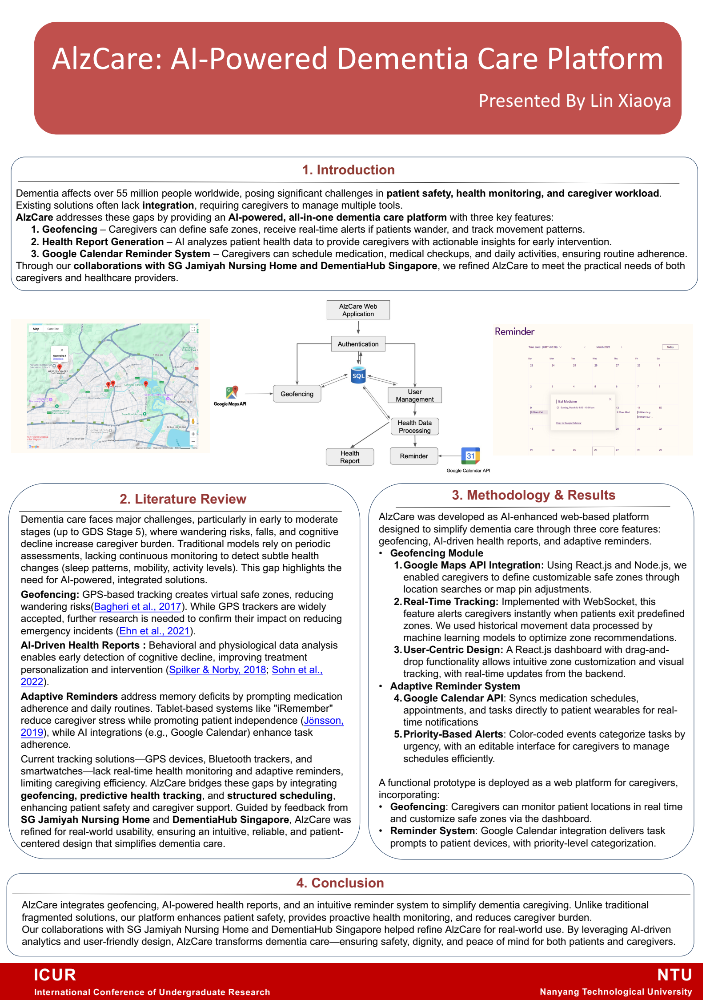
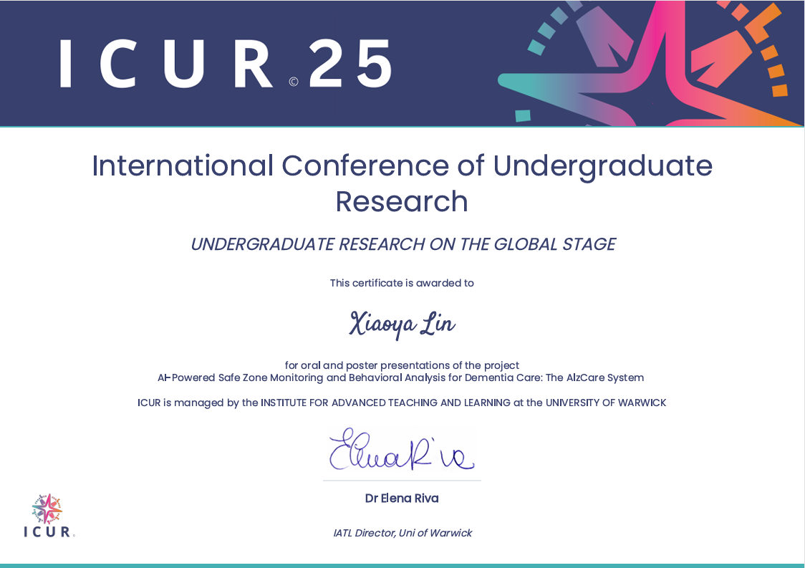

# 🔬 Academic Projects

## 1. AlzCare: AI-Powered Dementia Care Platform

<table style="border: none; border-collapse: collapse; width: 100%;">
  <tr>
    <td width="50%" valign="top" style="padding-right: 20px; border: none;">
      
<strong>The Problem:</strong> Dementia patients face risks of wandering, missed medication, and delayed health intervention. 
      <strong>The Solution:</strong> Developed an all-in-one web platform integrating <code>Geofencing</code>, <code>AI Health Reporting</code>, and <code>Automated Reminders</code>.

      <ul>
        <li>📍 <strong>Geofencing:</strong> Real-time wandering alerts using Google Maps API & WebSockets</li>
        <li>🧠 <strong>Health Analytics:</strong> AI-driven insights for early intervention</li>
        <li>📅 <strong>Smart Scheduling:</strong> Auto-syncs with Google Calendar for medication reminders</li>
      </ul>
      
<strong>Tech Stack:</strong> React.js · Node.js · Google Maps API

      
<em>Presented at the <strong>International Conference of Undergraduate Research (ICUR) 2025</strong></em>

    </td>
    <td width="50%" valign="top" align="center" style="border: none;">
      
      
▶ Click to Watch Demo

    </td>
  </tr>
  
  <tr>
    <td width="50%" valign="top" align="center" style="border: none; padding-top: 15px;">
      
      
📄 View Poster

    </td>
    <td width="50%" valign="top" align="center" style="border: none; padding-top: 15px;">
      
      
🏆 View Certificate

    </td>
  </tr>
</table>

## 2. Hotel Booking Trends & Cancellation Forecast
**Course Project Lead**
* Led a 4-member team to analyze booking behavior and predict cancellations.
* Optimized model to **91% accuracy** using **TensorFlow**, L2 regularization, and Batch Normalization.
* Delivered visual storytelling insights to 50+ course instructors and peers.

 
